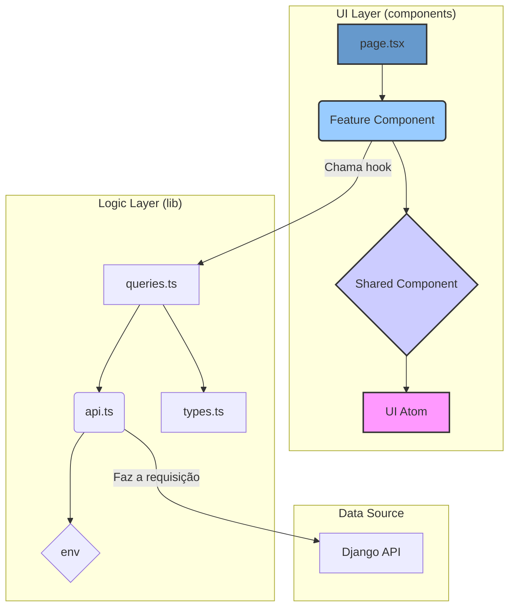

# Frontend Architecture Guide

Este documento descreve a arquitetura, os padrões e as convenções adotadas no projeto frontend, construído com Next.js, TypeScript e Tailwind CSS. O objetivo é garantir um desenvolvimento consistente, escalável e de fácil manutenção.

## Core Stack

- **Framework**: Next.js 14+ (com App Router)
- **Linguagem**: TypeScript
- **Estilização**: Tailwind CSS
- **Requisições HTTP**: Axios
- **Gerenciamento de Estado de Servidor**: TanStack Query (React Query)
- **Gerenciador de Pacotes**: Yarn

## Filosofia Principal: Separação de Concerns

A base da nossa arquitetura é uma estrita **separação de responsabilidades** entre a lógica da aplicação e a interface do usuário (UI).

-   `src/components`: Responsável exclusivamente pela **apresentação (View)**.
-   `src/lib`: Responsável pela **lógica de negócio e acesso a dados (o "Cérebro")**.

---

## Estrutura de Diretórios Detalhada

### `src/app`
- **Propósito**: Define o roteamento da aplicação. A estrutura de pastas aqui mapeia diretamente as URLs do site.
- **Convenção**:
    - Cada rota é um diretório (ex: `app/dashboard/`).
    - O arquivo `page.tsx` dentro de um diretório renderiza a UI principal daquela rota.
    - O arquivo `layout.tsx` define a estrutura de layout compartilhada para uma rota e suas sub-rotas.
    - O arquivo `loading.tsx` cria um esqueleto de UI (loading skeleton) que é exibido automaticamente enquanto os dados da página estão sendo carregados.
    - O arquivo `error.tsx` cria uma barreira de erro (error boundary) para tratar erros de forma elegante.

### `src/lib` - O Cérebro da Aplicação

#### `lib/api.ts`
- **Propósito**: Centralizar e configurar a comunicação com a API backend.
- **Implementação**: Exporta uma instância única e pré-configurada do Axios.
- **Exemplo**:
  ```typescript
  // src/lib/api.ts
  import axios from 'axios';

  export const api = axios.create({
    baseURL: process.env.NEXT_PUBLIC_API_URL,
    headers: {
      'Content-Type': 'application/json',
    },
  });

  // Futuramente, podemos adicionar interceptors para tratar autenticação ou erros:
  // api.interceptors.request.use(...)
  ```
- **Uso**: Em qualquer lugar que precisarmos fazer uma chamada de API, importaremos esta instância.
  - `import { api } from '@/lib/api';`

#### `lib/types.ts` (ou `lib/definitions.ts`)
- **Propósito**: Definir um "contrato" de dados para toda a aplicação. Centraliza todas as definições de tipos e interfaces do TypeScript.
- **Benefício**: Garante consistência, previne erros e melhora o autocomplete do editor.
- **Exemplo**:
  ```typescript
  // src/lib/types.ts
  export interface User {
    id: number;
    username: string;
    email: string;
    is_active: boolean;
    date_joined: string; // ISO 8601 date string
  }

  export interface Birthday {
    user: Pick<User, 'id' | 'username'>;
    date: string;
  }
  ```
- **Uso**: `import type { User } from '@/lib/types';`

#### `lib/queries.ts` (ou `lib/hooks/`)
- **Propósito**: Abstrair a lógica de data-fetching e gerenciamento de estado do servidor usando React Query.
- **Implementação**: Cria hooks customizados para cada endpoint da API. Cada hook encapsula uma chamada de API, gerenciando cache, estado de carregamento (`isLoading`), e erros.
- **Exemplo**:
  ```typescript
  // src/lib/queries.ts
  import { useQuery } from '@tanstack/react-query';
  import { api } from './api';
  import type { User } from './types';

  const fetchUsers = async (): Promise<User[]> => {
    const { data } = await api.get('/users/');
    return data;
  };

  export const useGetUsers = () => {
    return useQuery({
      queryKey: ['users'], // Chave de cache para esta query
      queryFn: fetchUsers, // Função que busca os dados
    });
  };
  ```
- **Uso**: `const { data: users, isLoading, isError } = useGetUsers();`

#### `lib/utils.ts`
- **Propósito**: Coleção de funções utilitárias, puras e genéricas.
- **Implementação**: Funções que manipulam dados brutos e não têm dependências com o resto da aplicação.
- **Exemplo**:
  ```typescript
  // src/lib/utils.ts
  import { type ClassValue, clsx } from 'clsx';
  import { twMerge } from 'tailwind-merge';

  // Função para merge de classes do Tailwind (essencial)
  export function cn(...inputs: ClassValue[]) {
    return twMerge(clsx(inputs));
  }

  // Exemplo de outra função útil
  export function formatDate(dateString: string): string {
    return new Date(dateString).toLocaleDateString('pt-BR', {
      day: '2-digit',
      month: 'long',
      year: 'numeric',
    });
  }
  ```
- **Uso**: `import { cn, formatDate } from '@/lib/utils';`

### `src/components` - A Interface do Usuário

#### `components/ui/`
- **Propósito**: Átomos de UI. Componentes básicos, genéricos, focados em apresentação e reutilização. São a base do nosso Design System.
- **Características**:
    - Controlados via `props`.
    - Estilizados com Tailwind CSS e `cva` (Class Variance Authority) para variantes.
    - Não contêm lógica de negócio.
- **Exemplo (`Button.tsx`):**
  ```tsx
  // src/components/ui/Button.tsx
  import * as React from 'react';
  import { cva, type VariantProps } from 'class-variance-authority';
  import { cn } from '@/lib/utils';

  const buttonVariants = cva(
    'inline-flex items-center justify-center rounded-md ...',
    {
      variants: {
        variant: {
          default: 'bg-primary text-primary-foreground hover:bg-primary/90',
          destructive: 'bg-destructive text-destructive-foreground hover:bg-destructive/90',
          outline: 'border border-input bg-background hover:bg-accent',
        },
        size: {
          default: 'h-10 px-4 py-2',
          sm: 'h-9 rounded-md px-3',
        },
      },
      defaultVariants: {
        variant: 'default',
        size: 'default',
      },
    }
  );

  // ... (componente Button que usa as variantes)
  ```

#### `components/shared/`
- **Propósito**: Moléculas e Organismos. Componentes que combinam vários átomos de `ui/` para formar partes reutilizáveis da interface.
- **Exemplos**: `Header`, `Sidebar`, `PageTitle`.
- **Características**: Podem ter estado de UI, mas ainda evitam lógica de negócio pesada.
- **Exemplo (`PageTitle.tsx`):**
  ```tsx
  // src/components/shared/PageTitle.tsx
  interface PageTitleProps {
    title: string;
    subtitle?: string;
  }

  export function PageTitle({ title, subtitle }: PageTitleProps) {
    return (
      <div>
        <h1 className="text-3xl font-bold tracking-tight">{title}</h1>
        {subtitle && <p className="text-muted-foreground">{subtitle}</p>}
      </div>
    );
  }
  ```

#### `components/features/`
- **Propósito**: Componentes específicos de uma funcionalidade do sistema. É aqui que a UI se conecta com a lógica de dados.
- **Características**:
    - Importam e utilizam os hooks da `lib/queries.ts`.
    - Passam os dados para componentes `shared` ou `ui`.
    - Contêm a maior parte da lógica de interação do usuário para uma feature específica.
- **Exemplo (`UserList.tsx`):**
  ```tsx
  // src/components/features/UserList.tsx
  'use client'; // Este componente precisa ser Client Component para usar hooks

  import { useGetUsers } from '@/lib/queries';
  import { PageTitle } from '@/components/shared/PageTitle';
  import { UserCard } from '@/components/shared/UserCard'; // Exemplo de outro componente

  export function UserList() {
    const { data: users, isLoading, isError } = useGetUsers();

    if (isLoading) return <div>Carregando usuários...</div>;
    if (isError) return <div>Ocorreu um erro ao buscar os usuários.</div>;

    return (
      <section>
        <PageTitle title="Nossos Usuários" />
        <div className="grid grid-cols-3 gap-4 mt-8">
          {users?.map((user) => (
            <UserCard key={user.id} user={user} />
          ))}
        </div>
      </section>
    );
  }
  ```

---

## Fluxo de Dados e Dependências

O diagrama a seguir ilustra como as diferentes partes da nossa arquitetura interagem. A regra principal é que as dependências fluem da UI para a Lógica, e nunca o contrário.



## Gerenciamento de Estado

-   **Estado do Servidor (Server State)**: Dados que vêm da nossa API Django. **SEMPRE** gerenciado pelo **React Query**. Ele é o responsável por cache, invalidação, re-fetching em background, etc. Não devemos usar `useState` + `useEffect` para buscar dados.
-   **Estado do Cliente (Client State)**: Estado efêmero da UI (ex: se um modal está aberto, o valor de um input não controlado, o tema da aplicação).
    -   **Padrão**: Use hooks nativos do React (`useState`, `useReducer`, `useContext`).
    -   **Global**: Se a complexidade crescer, podemos adotar uma biblioteca minimalista como **Zustand** ou **Jotai**. A decisão será tomada quando necessário (YAGNI).

---

## Estilização com Tailwind CSS

-   **Convenção**: Utilize as classes de utilitário do Tailwind diretamente no JSX.
-   **Componentização**: Quando um conjunto de classes se torna complexo ou se repete, ele deve ser extraído para um componente em `components/ui`. Evite criar classes CSS customizadas em arquivos `.css` a menos que seja para um caso muito específico que o Tailwind não cobre.
-   **Classes Condicionais**: Utilize a função `cn` (de `lib/utils.ts`) para aplicar classes de forma dinâmica ou condicional, mantendo o código limpo.

## Variáveis de Ambiente

-   Use o arquivo `.env.local` (que está no `.gitignore`) para todas as chaves de API e configurações específicas do ambiente de desenvolvimento.
-   Para que uma variável seja acessível no código do navegador, ela **DEVE** ser prefixada com `NEXT_PUBLIC_`.
-   **Exemplo**: `NEXT_PUBLIC_API_URL` está disponível no browser, mas `DATABASE_PASSWORD` estaria disponível apenas no lado do servidor.
