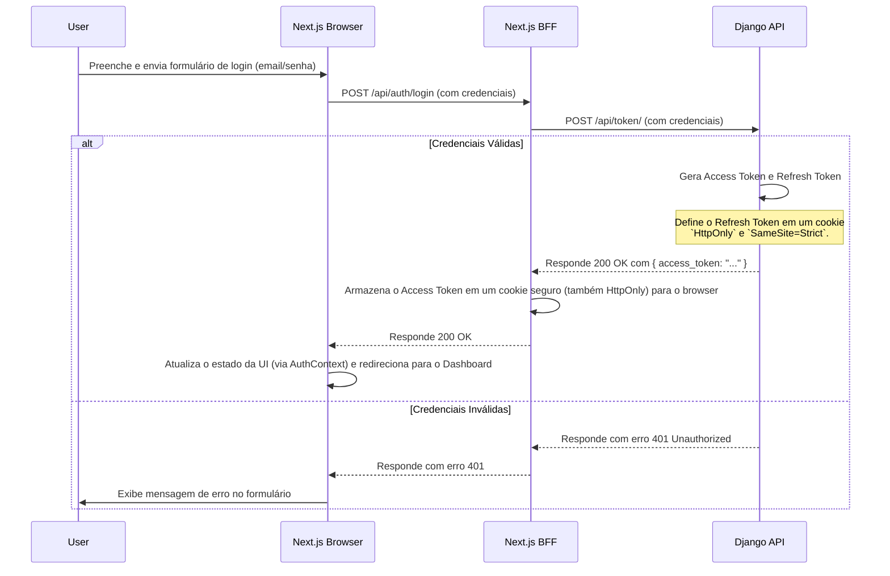
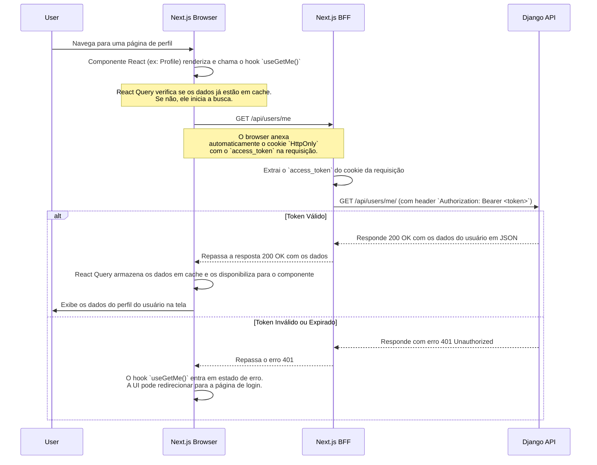

# Fluxos de Sistema - PoliticSystem

Este documento descreve os principais fluxos de interação do usuário e de dados dentro do sistema. Ele utiliza diagramas para visualizar a sequência de eventos em operações críticas.

## 1. Fluxo de Autenticação (Login)

Este fluxo detalha como um usuário faz login no sistema, desde a submissão do formulário até a atualização da UI. Ele ilustra a interação entre o frontend Next.js e o backend Django, seguindo as estratégias definidas no [ADR-001](./docs/adr/001-auth-strategy.md) e [ADR-002](./docs/adr/002-bff-architecture.md).

## 2. Fluxo de Requisição Autenticada (Ex: Buscar Dados do Usuário)

Este fluxo descreve como o frontend busca dados de uma rota protegida após o usuário já ter feito o login. Ele demonstra o papel central do BFF em repassar o token de autenticação de forma segura.

